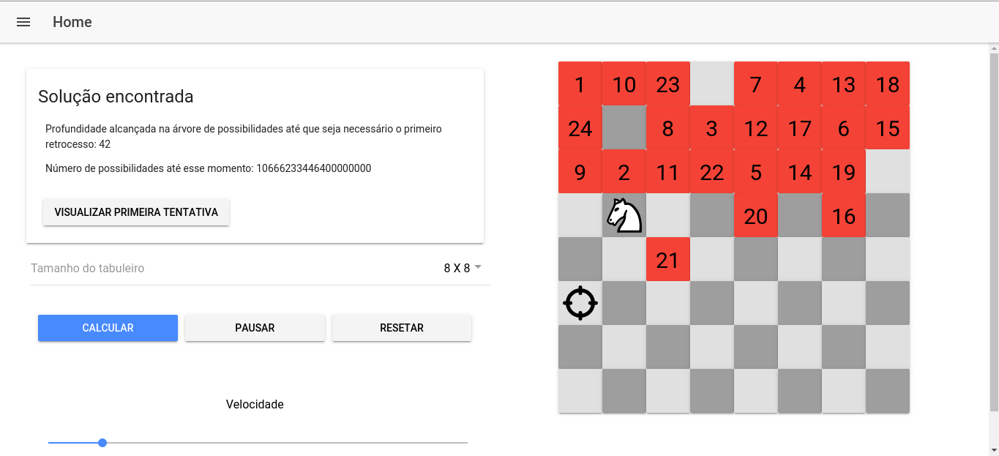

# Knight's Tour

Implementação da resolução do problema Passeio do Cavalo (Knight's Tour) por força bruta. Acompanha uma interface gráfica interativa que demonstra o passo-a-passo da resolução. Demonstração: https://knight-s-tour.web.app/

O problema consiste realizar, dentro de um tabuleiro de xadrez, um caminho onde a peça do cavalo passe por todas as casas sem repetir nenhuma. Como é definido nas regras, o cavalo apenas pode realizar movimentos em 'L'

# Desenvolvimento

A aplicação foi desenvolvida em Ionic 2

# Execução

## Opção 1 - Ambiente de desenvolvimento

- Instalar o ionic: https://ionicframework.com/
- Na pasta raiz do projeto, executar `ionic serve` 
- Por padrão, o servidor de desenvolvimento será iniciado em `http://localhost:8100`

## Opção 2 - Executando o Build pronto

Na pasta `/www` está localizado o `build` da aplicação para web. Para execução, basta servir os arquivos em um servidor `http`. Maneira de fazer isso:

 - Instalar o [http-server](https://www.npmjs.com/package/http-server) com o comando `npm install -g http-server`
 - Executar, dentro de `/www`, o comando `http-server`

 
